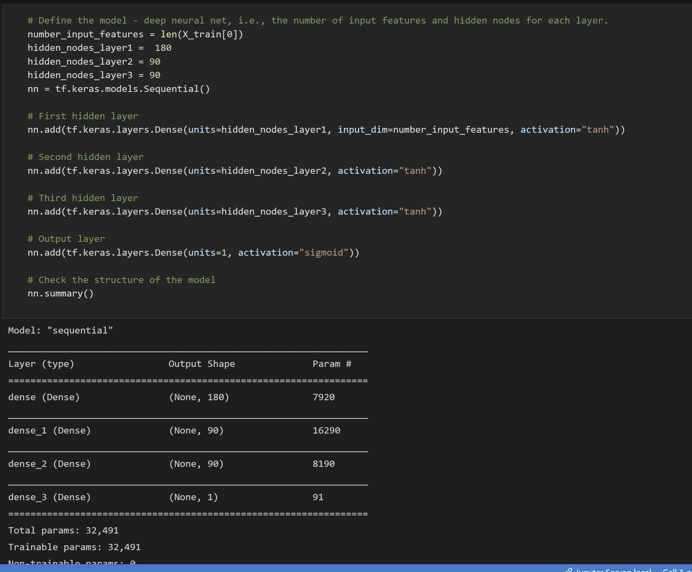

# Neural_Network_Charity_Analysis

## Overview of the Analysis
- The purpose of the analysis was to produce a neural network capable of categorizing a successful investment applicant vs an unsuccessful one. We were given a dataset containing information for a group of applicants. There were muliple columns of information about each applicant, as well as a column with binary values that signified success or not successful.

## Results
### Data Preprocessing
#### What variable(s) are considered the target(s) for your model?
- The target variable was success or the lack of success, "IS_SUCCESSFUL" was the column.

#### What variable(s) are considered to be the features for your model?
- The model Features were: APPLICATION_TYPE, AFFILIATION, CLASSIFICATION, USE_CASE, ORGANIZATION, STATUS, INCOME_AMT, SPECIAL_CONSIDERATIONS, ASK_AMT
#### What variable(s) are neither targets nor features, and should be removed from the input data?
- Columns Dropped: EIN, NAME

### Compiling, Training, and Evaluating the Model
#### How many neurons, layers, and activation functions did you select for your neural network model, and why?
- I began with two hidden layers(80, 30 nodes) and an output layer(1node). The hidden layers utilized an activation function of relu and simgmoid for the output function. 

- For my last iteration of optimization, I added a third hidden layer, changed the hidden layer activation functions to tanh. I also bumped the nodes to 180, 90, and 90. I found tanh to be slightly better than relu, but if the output layer was changed from sigmoid the model experinced a huge drop in accuracy. 

#### Were you able to achieve the target model performance?
- I did no achieve the target performance for the model. After optimization, my best model reached an accuracy of .7297.

#### What steps did you take to try and increase model performance?
- I changed the number of nodes, hidden layers, and activation functions. I dropped INCOME_AMT for one attempt, because I noticed not all of the entries were uniformly formatted. I belive this caused issues with the models, and if the data were transformed to integers it would likely increase performance of the model. Taking away this feature decreased the accuracy of the model even though it was a messy column. I also tried dropping ASK_AMT as well, it appeared as though it had some outliers. This also decreased performance, so one would assume these are neccesary features for a good model of this dataset.

## Summary: 
My final model had an accuracy of .7297. The result is reasonable, but not good enough to use as the sole decision maker for the task. I think if you were to use a RandomForestClassifier you would likely have similar results with a significantly shorter run time.
